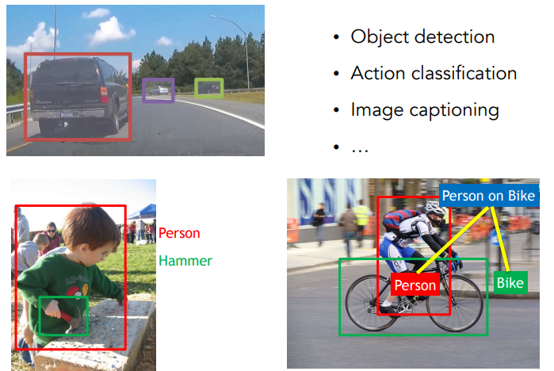
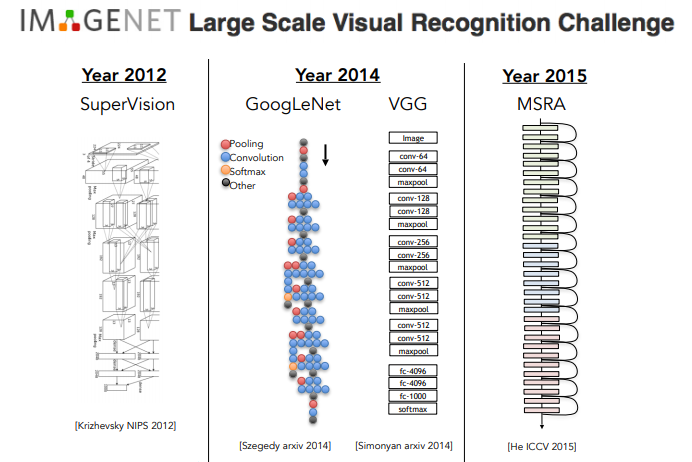

# Учебный курс. Системы машинного зрения
## Программа курса
* [Лекция 1. Введение](lesson1.md)
* [Лекция 2. Классификация изображений](lesson2.md)
* [Лекция 3. Функция потерь и оптимизация](lesson3.md)
* [Лекция 4. Введение в нейронные сети](lesson4.md)
* [Лекция 5. Свёрточные нейронные сети](lesson5.md)
* [Лекция 6. Обучение нейросетей, часть 1](lesson6.md)
* [Лекция 7. Обучение нейросетей, часть 2](lesson7.md)
* [Лекция 8. ПО для глубокого обучения](lesson8.md)

## Информация о курсе
Основная задача, на которой фокусируется курс — классификация изображений. При классификации изображений алгоритм должен отнести изображение к одной из заранее известных категорий. Эта проблема решается как в исследовательских кругах, так и в промышленности. Примеров классификации очень много: определение калорийности блюда по фотографии, распознавание различных произведений искусства, расшифровка рукописного текста и многое другое.

В этом курсе также рассматривается несколько других проблем распознавания изображений, опирающихся на инструменты классификации. Среди них — обнаружение объектов и создание текстового описания фотографий (image captioning). При обнаружении объектов мы не просто классифицируем изображение как «собака» или «кошка», а рисуем ограничивающие рамки, внутри которых должна быть та самая собака или кошка. Текстовое описание того, что изображено на фотографии, тоже основано на классификации.

Двигателем прогресса в этих проблемах стали появившиеся не так давно свёрточные нейронные сети (convolutional neural network, CNN). Настоящий прорыв случился в 2012 году, когда Джефф Хинтон и его аспиранты Алекс Крижевский и Илья Суцкевер создали семислойную свёрточную нейронную сеть AlexNet. Она очень хорошо показала себя в соревновании ImageNet. С тех пор появилась тенденция создавать всё более глубокие сети. В 2014 году появились многослойные GoogleNet и VGG. Тогда же вышла статья от исследователей из Microsoft Research Asia, которые создали остаточную нейросеть (residual network) со 152 слоями. 

В течение курса мы более подробно разберём, как работают эти модели, какие у них есть ограничения, в чём состоит сложность их создания и настройки. 

Основной прорыв в развитии нейронных архитектур произошёл сравнительно недавно. В первую очередь это связано с появлением и стремительным ростом производительности графических процессоров. GPU позволяют обрабатывать огромные объемы данных параллельно, что делает их идеальным инструментом для больших вычислений и обучения нейросетей. Помимо этого, сильно возросло число данных, доступных для обучения. 

Компьютерное зрение открывает множество потенциальных задач, главная из которых — научить машину видеть мир, как человек. Эта цель пока недостижима, поскольку порождает множество связанных с ней проблем: например, распознавание активности человека по видео, точное 3D-реконструирование объектов, семантическая сегментация изображений и многие другие. Но постоянно продвигаясь вперёд и придумывая такие потрясающие вещи, как дополненная и виртуальная реальность, мы наверняка придумаем новые, интересные решения.

