# Лекция 1. Введение
## Зачем нужно компьютерное зрение?
Компьютерное зрение — это анализ визуальных данных. Объем этих данных в современном мире постоянно растёт. Около 80% всего интернет-трафика составляет видео — и это без учёта изображений и других типов визуальной информации. Поэтому важно разрабатывать алгоритмы, которые смогут понимать и обрабатывать эти данные. 

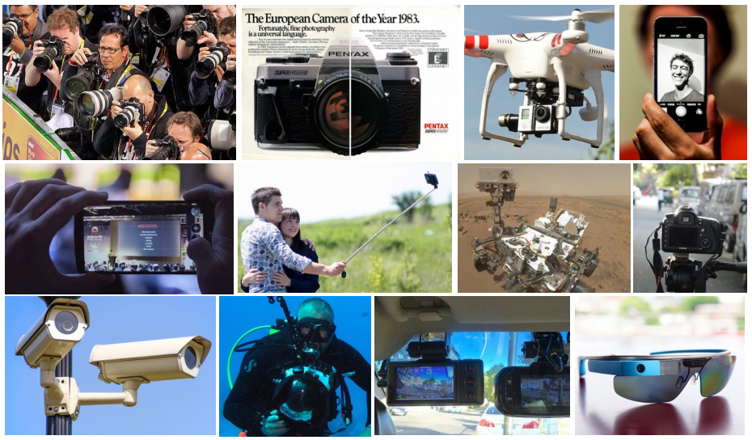

Иногда визуальную информацию сравнивают с тёмной материей по аналогии с физикой. Тёмная материя занимает очень большую долю массы во Вселенной, и мы знаем об этом благодаря существованию гравитационного притяжения на различных небесных телах. Тем не менее мы не можем непосредственно наблюдать её. С визуальными данными происходит примерно то же самое: они содержат множество бит, летающих по просторам Интернета. Но алгоритмам компьютерного зрения очень сложно понять, из чего же они состоят на самом деле.

Интересный факт: на YouTube каждую секунду загружаются видеоролики общей продолжительностью около 5 часов. То есть, их стало примерно на 15 часов больше, пока вы читали предыдущее предложение. Сотрудники Google физически не могут просматривать каждое видео вручную, поэтому им необходимы технологии, позволяющие автоматически распознавать содержание визуальных данных.

Компьютерное зрение затрагивает много областей науки и техники: в физике важно понимать процесс формирования образов, в биологии и психологии учёные исследуют, как люди и животные воспринимают и обрабатывают визуальную информацию. В робототехнике и автомобилестроении изображения помогают ориентированию на местности. Для создания систем, реализующих алгоритмы компьютерного зрения, нужны знания в областях информатики, математики и проектирования.

Этот курс фокусируется на определённом классе методов, реализуемых с помощью свёрточных нейронных сетей, и их применениях для различных задач распознавания образов. Для понимания остальных лекций вам понадобятся некоторые начальные знания в этих областях, поэтому в первом уроке будут затронуты две темы: краткая история компьютерного зрения и обзор всего курса.

## История компьютерного зрения
### Давным-давно
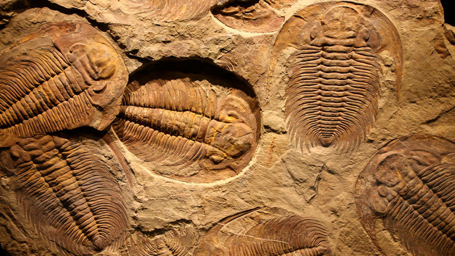

543 миллиона лет назад большую часть нашей планеты составляла вода. Существовало всего несколько видов животных, плавающих в океане, поэтому жизнь тогда была более спокойной. У зверей не было глаз: если еда плавала поблизости — они хватали её, если нет — просто дрейфовали вокруг. Но кое-что потрясающее произошло 540 миллионов лет назад: из исследований окаменелостей учёные обнаружили, что за короткий период времени — 10 миллионов лет — количество видов животных увеличилось в невероятных размерах. От нескольких видов до нескольких сотен тысяч — что же вызвало такие изменения? 

В течение долгого времени это была загадка, которую биологи называли эволюционным Большим Взрывом. Но несколько лет назад австралийский зоолог Эндрю Паркер предложил одну из самых убедительных теорий. Из исследований ископаемых он обнаружил, что в этот период у животных впервые появились глаза, и, благодаря развитию зрения, началась фаза стремительного видообразования. У тех, кто научился видеть, жизнь стала намного активнее. Хищники преследовали добычу, а добыча старалась убежать от хищников. Чтобы сохранить свой вид, животные должны были развиваться очень быстро. Это и послужило толчком к эволюции.

В человеческом мозге почти 50% нейронов участвуют в визуальной обработке. Это самая большая сенсорная система, которая позволяет нам выживать, работать, двигаться, управлять вещами, общаться, развлекаться и многое другое. Зрение сыграло большую роль в развитии животных и людей.

### Ренессанс
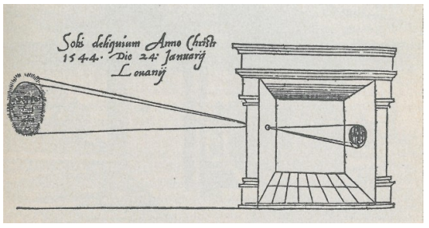

А что насчёт технического зрения и камер? Самый первый известный нам пример фотоаппарата появился в 1600-е годы в эпоху Возрождения — камера Обскура. Принцип её работы очень похож на первые появившиеся у животных глаза. Это была коробка с небольшим отверстием, собирающим свет на панели (матовом стекле или тонкой белой бумаге) в задней части камеры. В результате получается перевёрнутая проекция изображения. 

С тех пор разработка фотоаппаратов продвинулась достаточно далеко, и сегодня камеры — одно из самых популярных устройств, которым люди пользуются на своих смартфонах. 

### 1950-е
С развитием биологии люди начали изучать механизм зрения как у человека, так и у животных. Одна из самых значимых работ в этой области, послужившая толчком к развитию компьютерного зрения — исследование Торстена Визеля и Дэвида Хьюбела в области электрофизиологии. В 50-х и 60-х годах прошлого века они искали ответ на вопрос: «Как устроен механизм визуальной обработки приматов и млекопитающих» Для изучения они выбрали мозг кошки, более-менее похожий на человеческий с точки зрения обработки визуальных данных.  Учёные подсоединили электроды к затылочной части, где располагается область зрительной зоны, и наблюдали, как нейроны реагируют на электрические стимулы. Оказалось, что за восприятие визуальной информации отвечает множество типов клеток, и одни из самых важных — те, что реагируют на смещение краёв при движении предметов. Так исследователи смогли найти связь определённых нейронов зрительной зоны коры головного мозга с конкретным местом зрительного поля. 

### 1960-е
История компьютерного зрения также началась примерно в начале 60-х годов. Учёный Ларри Робертс опубликовал набор работ “Block World”, в которых рассказывалось о восстановлении трёхмерной геометрии простых сцен, состоящих из блоков. 

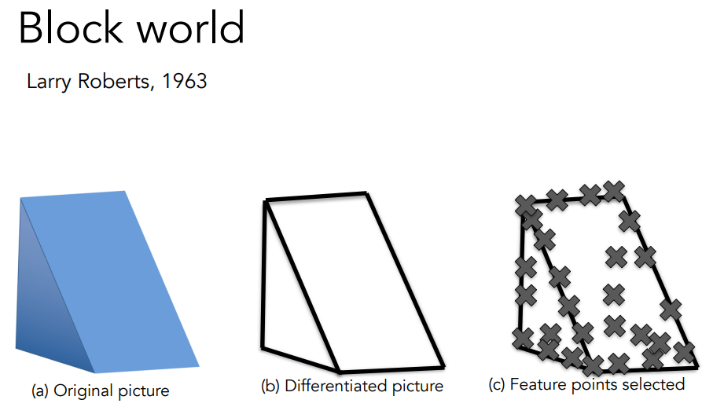

В 1966 году начался знаменитый проект MIT “The Summer Vision Project”, цель которого — привлечь сотрудников к разработке визуальной системы. Прошло 50 лет, и область компьютерного зрения превратилась из летнего проекта в поле для тысяч исследований по всему миру. Многие проблемы до сих пор не решены, но эта тема стала одной из самых важных и быстро развивающихся в мире искусственного интеллекта. 

### 70-е и 80-е 

Ещё один человек, оказавший влияние на развитие компьютерного зрения — учёный Дэвид Марр из MIT. В конце 70-х годов он написал книгу Vision: A computational investigation into the human representation and processing of visual information, где рассказал о возможных путях развития и алгоритмах, которые позволят компьютерам распознавать визуальные образы. Также он описал процессы, происходящие во время мыслительной обработки двумерного изображения и воспроизведения его трёхмерного представления. Он разбил их на три этапа: первый называется «начальный набросок», включающий в себя края, линии и границы предметов. Следующий шаг — «2 1/2-D набросок», когда человек начинает обрабатывать поверхности, слои и глубину изображения. Собрав всё воедино, мы можем построить иерархически организованную 3D-модель. Этот идеализированный процесс помог понять, каким образом можно деконструировать визуальную информацию.

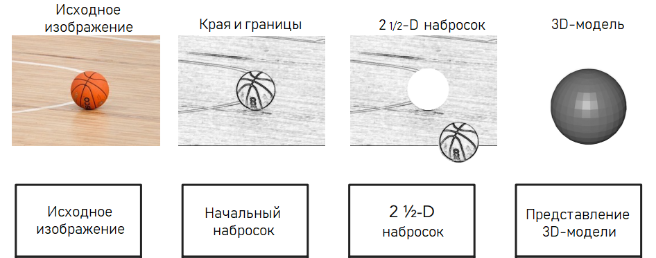

Другая основополагающая работа была проделана в 70-х годах, когда исследователи задались вопросом: «Как мы можем выйти за пределы простого блочного мира и начать распознавать или воссоздавать объекты реального мира?». В то время было доступно крайне мало данных, а компьютеры были медленными. Но это не помешало группам учёных из Стэнфорда и SRI предложить две похожие друг на друга идеи, одна из которых называется «обобщённый цилиндр» ("generalized cylinder"), а другая — «изобразительная структура» ("pictorial structure"). Их суть заключалась в разбиении всех трёхмерных объектов на простые геометрические фигуры. Например, модель человека можно воссоздать с помощью обобщённых цилиндрических форм. 

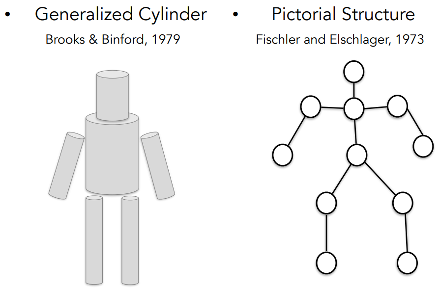

Похожую работу в 80-х годах проделал Дэвид Лоу, который пытался воссоздать формы предметов, используя комбинации прямых линий.

### 1990-е

Все эти проекты были достаточно амбициозными для того времени, но остались на уровне примеров. Прогресса с точки зрения решения реальных проблем было немного. Поэтому у исследователей возникла следующая теория: «Если распознавать объекты слишком сложно, возможно, следует сначала выполнить их сегментацию?» Так родилась задача группировки пикселей в области интереса. Взяв группу пикселей со схожими свойствами, мы сможем определить тип объекта, к которому они относятся — это называется сегментация изображений. Одна из первых работ в этой области принадлежит Джитендре Малик и его ученику Джанбо Ши из университета Беркли, которые решали задачу с помощью теории графов.

### 2000 — 2007

Вслед за сегментацией возникла новая проблема компьютерного зрения — распознавание лиц. Это была одна из самых важных и актуальных задач, и с начала 1999-2000 годов методы машинного обучения стали добиваться в ней неплохих успехов. Среди них преобладают статистические алгоритмы, например: метод опорных векторов, бустинг, графические модели, в том числе первые нейросети. Наиболее впечатляющей оказалась работа Паула Виолы и Майкла Джонса, использующая алгоритм AdaBoost для обнаружения лиц в режиме реального времени (метод Виолы-Джонса).

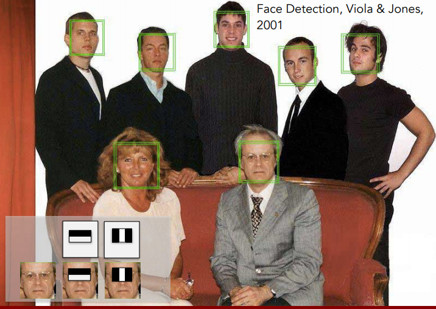

Учёные разработали свой алгоритм в 2001 году, когда компьютеры всё ещё были медленными, но могли справиться с детектированием лиц на изображениях почти в реальном времени. Через пять лет после публикации их статьи Fujifilm выпустила первую цифровую фотокамеру, которая обнаруживает лица прямо во время съёмки. Так от фундаментальных научных исследований компьютерное зрение перешло к применениям в реальном мире.

Ещё один выдающийся метод в распознавании объектов разработан в конце 90-х — начале 2000-х годов Дэвидом Лоу. Он называется SIFT (scale-invariant feature transform) и используется для выявления и описания локальных признаков изображения. Представьте, что у вас есть две похожие фотографии с автомобильным знаком «СТОП». Человек может легко сопоставить их и сказать, что здесь изображён один и тот же объект. Компьютеру будет сложнее это сделать из-за различных помех: изменение угла съёмки, расстояния, освещения и так далее.  Идея алгоритма заключается в поиске участков этого объекта — особенностей или признаков, которые будут инвариантны к этим изменениям. Поэтому задача распознавания состоит в том, чтобы извлечь из объектов некоторые значимые признаки и сопоставить их с похожими объектами. Это гораздо проще, чем сравнивать предметы целиком. Ниже приведён пример сопоставления особенностей для знаков «СТОП».

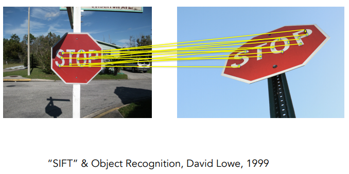

Использование признаков изображений помогло начать распознавать целые сцены. Например, алгоритм «Сопоставление пространственной пирамиды» (“Spatial Pyramid Matching”) может определить, что изображено на фотографии: пейзаж, шоссе, гостиная, кухня и тому подобное. 

### 2007 — настоящее время

В первом десятилетии 21-го века сильно выросло качество изображений. Цифровые камеры становились всё лучше и лучше, а вместе с ними улучшались и увеличивались в объёме данные для изучения компьютерного зрения. Это сыграло немаловажную роль, поскольку появились эталонные наборы данных (бенчмарки), позволяющие измерить точность распознавания объектов. Один из самых популярных датасетов называется PASCAL Visual Object Challenge. Он состоит из 20 классов объектов. Вот примеры трёх из них: поезд, самолёт, человек. 

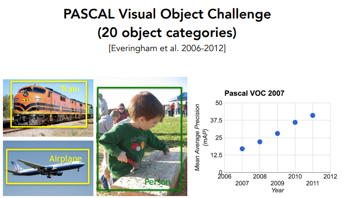

В каждой категории представлено от тысячи до десяти тысяч изображений. Используя часть из них в качестве тестовых данных, можно оценить достигаемую методами точность.

Справа на рисунке изображён график, показывающий эффективность алгоритмов по распознаванию объектов с 2007 по 2012 годы.

В связи с растущей точностью этих методов учёные задались новым вопросом: «Готовы ли мы распознавать любые объекты?» Причиной к созданию подобных решений также послужила проблема переобучения нейросетей. Переобучение — это явление, возникающее, когда алгоритм подстраивается под конкретный набор данных и делает на нём хорошие прогнозы, но при этом очень плохо работает с новыми объектами. Переобучению подвержены большинство методов Machine Learning, и один из способов избежать его — использовать как можно больше обучающих данных. Это послужило толчком к созданию проекта ImageNet.

ImageNet появился благодаря группе энтузиастов из Стэнфордского университета. Они хотели собрать максимально полный датасет из всех изображений, которые только можно найти на просторах Интернета. На его создание ушло три года тяжёлого труда: исследователи загружали миллионы изображений из сети и организовывали их с помощью словаря WordNet. Словарь содержит десятки тысяч классов объектов! Итоговый набор данных был опубликован в 2009 году и содержал около 14 миллионов фотографий, организованных в 22 тысячи категорий объектов и сцен. Это самый большой датасет того времени. 

В конце 2009 года команда ImageNet объявила международный конкурс под названием “ImageNet Large-Scale Visual Recognition Challenge”. Для него было отобрано 1,4 миллиона изображений и 1000 классов. Если участвующий в соревновании алгоритм может вывести 5 меток для одного изображения и среди них содержится правильный объект — это считается успехом.

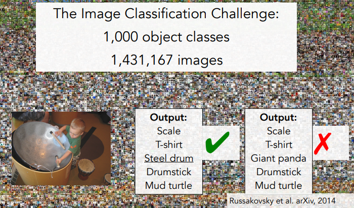

Ниже приведены результаты конкурса с 2010 по 2015 годы.

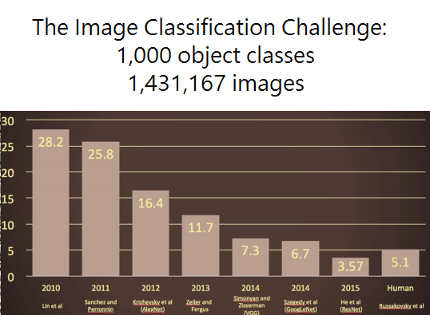

Уровень ошибок неуклонно снижается и в некоторых случаях даже превосходит человека. Но в компьютерном зрении осталось ещё много нерешённых проблем, о которых вы узнаете из этого курса.