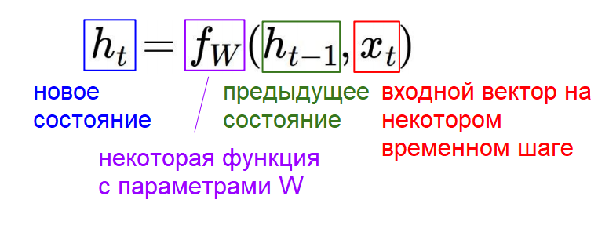

# Лекция 10. Рекуррентные нейронные сети

## Рекуррентные сети: введение

Мы уже знакомы с основными принципами построения архитектур для самых простых нейросетей. Обычные модели состоят из группы слоёв и принимают на вход объект фиксированного размера — например, изображение. Каждый слой применяет к этому объекту какие-либо преобразования, и на выходе мы получаем результат — для классификации это будет метка класса. Но в некоторых областях машинного обучения нам хотелось бы иметь большую гибкость в типах данных, которые могли бы обрабатывать наши модели.

Именно это позволяют делать рекуррентные нейронные сети (Recurrent Neural Network, RNN). Иногда их делят на несколько разновидностей: “one to one”, “one to many”, “many to one” и “many to many”.

К архитектурам “one to one” можно отнести модели, которые мы рассматривали ранее: с определённым размером входных и выходных данных. В случае “one to many” при заранее заданном типе и размере входного объекта можно получить вывод разной длины. Такой подход применяется в популярной задаче описания изображений (image captioning). Вариант “many to one” работает ровно наоборот — мы подаём на вход данные нефиксированного размера и получаем их чётко определённые характеристики. Так, например, можно по фрагменту видео определять вид активностей или действия, которые в нём происходят.

И, наконец, “many to many” архитектуры имеют варьирующиеся размеры как входных, так и выходных данных. К решаемым ими задачам относятся машинный перевод (исходная и переведённая фразы могут быть разной длины) и покадровая классификация видео.

Рекуррентные нейросети очень полезны даже при решении задач “one to one”. Рассмотрим популярную проблему распознавания рукописных цифр. Вместо того, чтобы просто сделать один прямой проход и сразу выдать решение, рекуррентная сеть быстро «просматривает» различные части изображения. В терминологии этот процесс называется «проблеск» (glimpse). Сделав несколько таких проблесков, модель принимает окончательное решение о том, какое число изображено на фотографии. Это позволяет существенно повысить точность распознавания и лучше контролировать процесс обучения.

Итак, как же устроена рекуррентная нейросеть? Внутри архитектуры располагается базовая рекуррентная ячейка. Модель принимает некоторые входные данные x и отправляет их в RNN, которая имеет скрытое внутреннее состояние. Это состояние обновляется каждый раз, когда в RNN поступают новые данные. Часто нам необходимо, чтобы RNN генерировала некоторый вывод на каждом временном отрезке. Поэтому после чтения входных данных и обновления скрытого состояния RNN будет создавать выходные данные.

Попробуем подробнее разобраться, что же происходит в загадочном зелёном прямоугольнике с надписью RNN. Внутри него мы вычисляем рекуррентное соотношение с помощью функции **f**, которая зависит от весов **w**. Чтобы найти новое состояние **ht**, мы берём предыдущее скрытое состояние **ht⁻1**, а также текущий ввод **xt**. Когда мы отправляем в модель следующие входные данные, полученное нами скрытое состояние **ht** передаётся в эту же функцию, и весь процесс повторяется.

Чтобы генерировать вывод в каждый момент времени, в модель добавляются полносвязные слои. Они постоянно обрабатывают состояния **ht** и выдают основанные на них прогнозы. При этом функция **f** и веса **w** остаются неизменными.

Самая простая реализация рекуррентной сети будет выглядеть следующим образом:

Тангенс здесь используется для введения нелинейности в систему. 

Концепция скрытого состояния, которое периодически возвращается к самому себе, может показаться немного запутанной. Более понятным будет представить рекуррентный процесс в виде развёртывания вычислительного графа за несколько временных шагов.

## Возвращение к вычислительным графам

Если вы не знакомы с вычислительными графами, о них можно прочитать в этой [лекции](lesson4.md).

На первом временном шаге у нас есть первоначальное скрытое состояние **h0**. Обычно оно инициализируется нулём. Также на вход подаются данные **xt** и веса **W** — всё это отправляется в функцию **f**, которая вычисляет новое состояние **h1**. И с каждыми новыми входными данными мы повторяем процесс. 

Очередное новое состояние даёт нам выходные данные **yi**, с помощью которых мы можем посчитать потери **Li**. Просуммировав все **Li**, мы получим полные потери нашей модели. Такой подход используется в “many to many” архитектурах и наглядно показан на рисунке ниже: 

При этом мы точно также можем применять здесь метод обратного распространения ошибки и вычисления градиентного спуска, как мы это делали в обычных полносвязных нейросетях. 

В случае, если мы хотим подавать на вход данные фиксированного размера и получать разнообразный вывод (“one to many”), из нашего графа исчезнут разные варианты xi. Модель будет выглядеть следующим образом:

С “many to one” ситуация будет обратная:

Также есть более сложные модели “many to many”, применяющиеся в машинном переводе, — они называются “sequence to sequence”. По сути это комбинация методов “many to one” и “one to many”, которые располагаются друг за другом и называются энкодер и декодер соответственно. Энкодер получает данные различной длины — например, предложение на английском языке. С помощью скрытых состояний он формирует из исходных данных вектор, который затем передаётся в декодер. Последний, в свою очередь, генерирует из полученного вектора выходные данные — исходную фразу, переведённую на другой язык.

Подробнее о том, как выглядят нейросети для машинного перевода и, в частности, Google-переводчик, можно прочитать в статье [Google преодолевает барьер между человеческим и машинным переводом](https://www.reg.ru/blog/google-preodolevaet-barer-mezhdu-chelovecheskim-i-mashinnym-perevodom/). А мы вернёмся к распознаванию изображений и поговорим об image captioning.

## Image captioning

Суть этой задачи заключается в том, чтобы нейросеть составила текстовое описание фотографии. Нам необходимо сначала классифицировать объекты на изображении, а затем передать результат (одну или несколько меток) в языковую рекуррентную модель, которая сможет составить из них осмысленную фразу. При этом мы действуем точно так же, как с обычной языковой моделью: преобразуем метку изображения в вектор, который обрабатывается декодером.

Чтобы рекуррентная сеть понимала, где именно начинается предложение, во время обучения на её вход подаётся стартовый опознавательный знак (<START> token). Для построения фразы используется заранее подготовленный словарь, например, из английских слов. И он может быть довольно большим.

При переходе на каждое следующее скрытое состояние мы сохраняем как уже сгенерированные слова, так и информацию об изображении. В конце предложения в нейросеть отправляется финальный токен (<END>). Во время тестирования модель уже самостоятельно определяет, где должно начинаться и заканчиваться описание изображения.

Обычно подобные архитектуры создаются с помощью контролируемого обучения (supervized learning). Это означает, что в обучающих датасетах уже присутствуют как изображения, так и описания для них. Наиболее популярным и самым большим набором данных является [Microsoft COCO](http://cocodataset.org/#home). Помимо image captioning он также применяется для сегментации, поиска ключевых точек и даже построения трёхмерной модели человека на основе его позы.

## Image captioning + Attention

Модели, основанные на внимании (attention) немного более продвинутые, чем обычные нейросети. Они могут концентрироваться на отдельных частях изображения, что позволяет избежать зашумления данных.

Идея состоит в том, что свёрточная сеть теперь будет генерировать не один вектор, описывающий всё изображение, а набор векторов для нескольких участков исходного снимка. В дополнение к работе со словарём на каждом временном шаге модель также производит распределение по точкам на изображении, которые она обрабатывает в данный момент. Это позволяет ей научиться находить наиболее важные участки, на которых необходимо фокусироваться.

После обучения можно увидеть, что модель переносит своё внимание по изображению для каждого генерируемого слова.

Существуют также понятия мягкого и жёсткого внимания (soft and hard attention). При мягком внимании мы берём взвешенную комбинацию признаков по всему изображению, тогда как в случае жёсткого внимания мы заставляем модель выбирать только один небольшой участок для обработки на каждом временном шаге. При этом жёсткое внимание, строго говоря, не является дифференцируемой функцией. Поэтому для обучения такой модели необходимо использовать более изощрённые приёмы, чем обычное обратное распространение ошибки. Мы подробнее затронем эту тему в одной из следующих лекций.

Также нейросети, основанные на внимании, повсеместно используются для ответов на визуальные вопросы (Visual Question Answering). Цель этой задачи — обучить модель отвечать на вопрос по изображению. Например, она должна уметь не только называть сами объекты на фотографии, но и считать их, распознавать цвета и оценивать расположение относительно друг друга. Мы уже рассказывали о подобных архитектурах в [статье о VQA](https://www.reg.ru/blog/nejroset-opisyvaet-mir-nezryachim-lyudyam/) и [нейро-символическом мышлении](https://www.reg.ru/blog/uchim-nejroseti-rassuzhdat-o-tom-chto-oni-vidyat/).

`Пример Visual Question Answering`