# Лекция 2. Классификация изображений
В данной лекции будут рассмотрены алгоритмы классификации изображений и увидим, как они работают на практике.

## Несколько слов о классификации
Как же работает классификация? Когда ваша система получает входное изображение, ей уже известен фиксированный набор категорий или меток. Это могут быть любые объекты: «кошка», «собака», «самолёт», «грузовик» и так далее. Компьютер должен посмотреть на изображение и назначить ему одну из меток. 

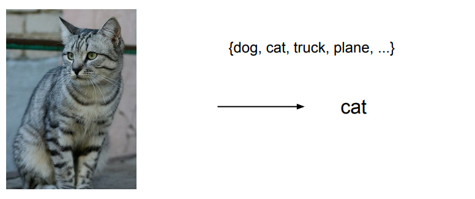
Классификация

Со стороны задача выглядит несложной, поскольку большая часть нашей зрительной системы запрограммирована на распознавание объектов. Но для машины это не так-то просто.

## Проблема классификации
Когда компьютер смотрит на изображение, то не видит целостное представление кошки или любого другого объекта. Он видит лишь гигантскую сетку чисел. Например, если размер изображения 800 на 600 и каждый пиксель представлен тремя числами для красного, зелёного и синего каналов, то получится сетка из 800х600х3 = 1,440,000 чисел. Очень трудно выделить из них какой-то конкретный предмет, представленный на фотографии. 

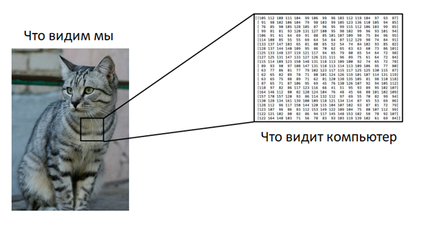

Эта проблема получила название «семантический разрыв» — непонимание информации, которая заключена в данных. Например, если мы снимем кошку с другого ракурса или при ином освещении, то вся сетка чисел будет выглядеть совершенно иначе. Помимо этого, животные могут принимать множество различных поз, или же на фотографии может оказаться только часть кошки, например, хвост. Алгоритмы распознавания должны быть устойчивы к таким изменениям.

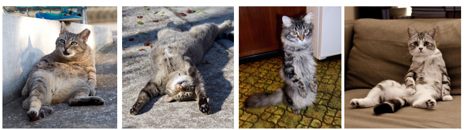

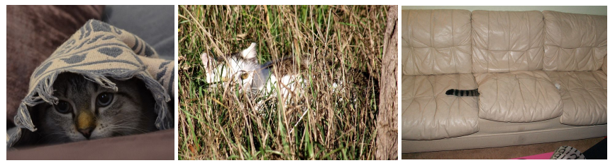

Помимо этих сложностей существует ещё проблема внутриклассовых вариаций, когда одно понятие охватывает множество визуальных проявлений. Например, кошки могут быть разных пород, возрастов и размеров. И методы распознавания должны обрабатывать все возможные варианты.

## Пытаемся решить проблему
Первое, что приходит в голову — создать эталонные правила. Мы знаем, что у кошек есть уши, глаза, рот и нос. На фотографиях с ними мы можем обнаружить края, а затем классифицировать разные углы и границы: например, определить, каким образом пересекаются линии ушей и носа. 

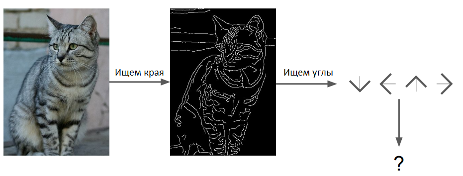

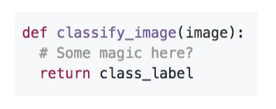

Но явные наборы правил работают не очень хорошо: любое отклонение может всё сломать, а для новых объектов придётся создавать новые условия. Поэтому такой подход не является масштабируемым.

## Подход, основанный на данных
Вместо того, чтобы вручную пытаться создать набор правил, можно открыть интернет и собрать большой набор данных с фотографиями кошек, самолётов, оленей и других вещей. Для этого подойдёт поиск картинок Google или уже готовый датасет. Затем необходимо обучить классификатор, отправив в него все собранные изображения. На выходе мы получим модель, обобщающую знания о распознавании разных объектов. После этого она сможет работать на новых изображениях и отличать кошек от собак. 

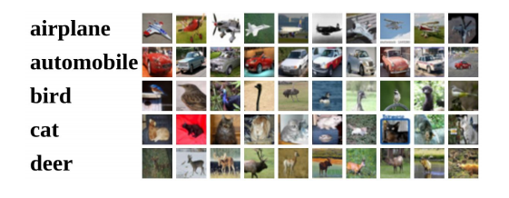

Итак, вместо одной функции, которая просто распознаёт объект на входном изображении, мы получили две: первая называется «обучение» — это процесс обработки изображений и создания модели. Вторая функция — «прогноз» — распознаёт новые фотографии. Вместе они составляют основу для свёрточных нейронных сетей и глубокого обучения в целом. 

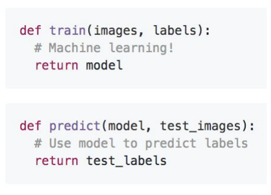

## Метод ближайшего соседа
Для начала рассмотрим самый простой классификатор, который носит название «метод ближайшего соседа». В процессе обучения он запоминает все исходные данные, а затем на этапе прогнозирования пытается найти среди них наиболее похожие на новое изображение.

Возьмём набор данных CIFAR-10, содержащий 10 различных классов и около 50000 обучающих и 10000 тестовых образцов. 

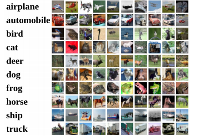

Так на нём работает классификатор ближайшего соседа:

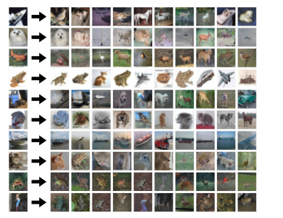

Слева показаны тестовые изображения, а справа — наиболее похожие на них обучающие образцы. Можно заметить, что они не всегда оказываются правильными. Взяв наиболее близкого соседа и его метку, алгоритм классифицирует тестовое изображение. 

## Как это работает? 
Как же сравнить два изображения? На самом деле для этого есть много разных способов. В примере выше использовалось расстояние L1, также известное как манхэттенское. Оно просто сравнивает между собой пиксели фотографий. Предположим, что у нас есть тестовый образец размером 4х4 пикселя. Возьмём одно из обучающих изображений и вычислим абсолютную разницу между цветами пикселей обучающего и тестового образцов, а затем просуммируем полученные значения.

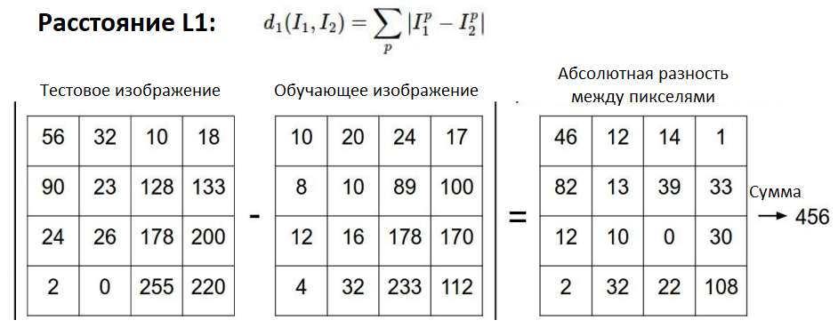

Реализация метода ближайшего соседа на Python:
