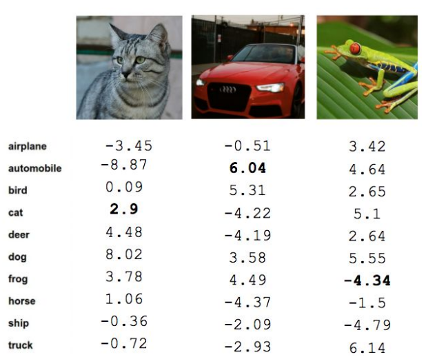
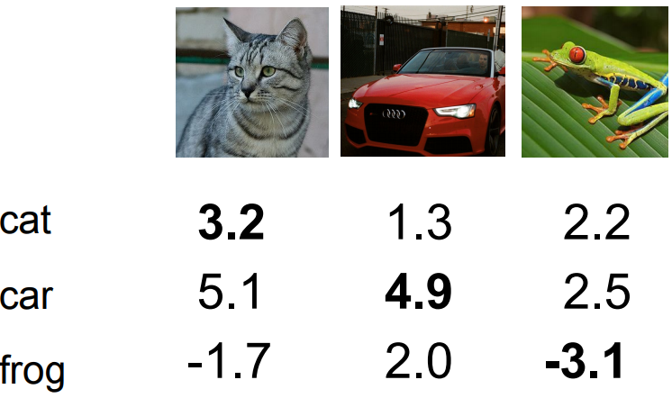

# Лекция 3. Функция потерь и оптимизация
## Что делать, если “cat” классифицируется как “dog”
Вспомним о линейном классификаторе. Мы выяснили, что он состоит из двух частей: входных данных X и набора весов W. Но мы не раскрыли главный вопрос: как именно нужно использовать обучающие данные, чтобы определить значения W, с которыми классификатор будет работать лучше всего?

Рассмотрим простой пример. Пусть обучающие данные состоят всего из трёх изображений и 10 исходных классов, а параметры W выбраны произвольно. Вы можете заметить, что некоторые из полученных оценок сильно выше или ниже, чем другие:

Например, изображение с кошкой получило оценку 2.9 для метки “cat” и 8.02 для метки “dog”. Картинка с лягушкой и вовсе получила отрицательную оценку для своего класса. А фото с автомобилем действительно достигает наивысшей оценки для метки “automobile”. Это говорит о том, что наш классификатор работает не очень хорошо. 

Чтобы автоматически определить, какие значения W будут лучшими, нам нужен какой-то способ количественной оценки «непригодности» для любого W. И этим способом будет специальная функция, которая принимает на вход значения W и определяет, насколько плохо они работают. В машинном обучении она называется функцией потерь (loss function).

Мы рассмотрим несколько примеров, которые вы можете использовать для классификации изображений. Если функция потерь выдаёт слишком большие числа — значит, выбранные параметры работают плохо. Поиск правильных весов W, при которых функция достигает минимума, называется оптимизацией.

## Функция потерь. Немного математики

Упростим задачу и из 10 классов оставим только три. Для линейного классификатора f(x,W) = Wx с произвольными W получим следующее:

