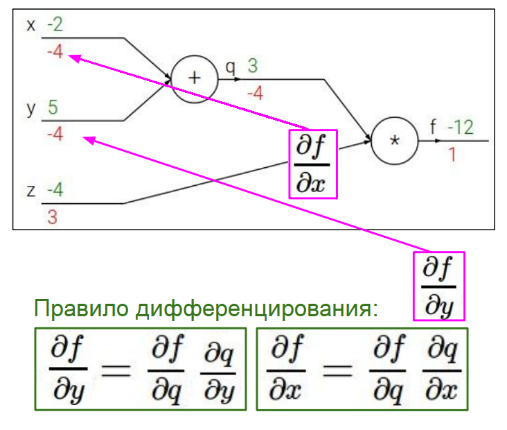

# Лекция 4. Введение в нейронные сети

Вспомним определение классификатора, на котором мы остановились. Функция f принимает данные x и параметры W на вход и выдаёт вектор оценок s для каждой из категорий, которые вы хотите классифицировать. Также у нас есть функция потерь L (например, SVM), определяющая, насколько правильные получились оценки. С её помощью мы можем вычислить потери данных. Узнать «простоту» модели помогает регуляризация. 

Наша цель — найти параметры W, соответствующие наименьшим потерям. Для этого мы используем отрицательное направление градиента функции L, который указывает путь к её минимуму.

Мы выяснили, что есть два основных способа вычислить градиент: аналитический и числовой. Числовой метод достаточно прост, но работает очень медленно и выдаёт приблизительные значения. Аналитический градиент более точный и быстрый, но в при его подсчёте можно легко допустить ошибки. Чтобы избежать этого и легко вычислять градиент даже для сложных функций, лучше всего использовать вычислительные графы.

## Введение в теорию графов и backpropagation

Вычислительный граф — это иллюстрированная запись какой-либо функции, состоящая из вершин и рёбер. Вершины (иногда их ещё называют узлы) — вычислительные операции, которые необходимо выполнить, а рёбра связывают их в определённую последовательность. 

На рисунке выше изображён пример графа с нашим классификатором. Узел с операцией (*) означает умножение матриц параметров W и данных x, результатом которого является вектор весов s. Следующая вершина зависимых потерь (hinge loss) определяет потери данных L. Узел R вычисляет регуляризацию. И, наконец, в самом конце мы получаем общие потери, суммируя регуляризацию и потери данных.

Преимущество графов в том, что они позволяют использовать так называемый метод обратного распространения ошибки (backpropagation). Этот алгоритм рекурсивно использует [правило дифференцирования сложной функции](https://ru.wikipedia.org/wiki/%D0%94%D0%B8%D1%84%D1%84%D0%B5%D1%80%D0%B5%D0%BD%D1%86%D0%B8%D1%80%D0%BE%D0%B2%D0%B0%D0%BD%D0%B8%D0%B5_%D1%81%D0%BB%D0%BE%D0%B6%D0%BD%D0%BE%D0%B9_%D1%84%D1%83%D0%BD%D0%BA%D1%86%D0%B8%D0%B8) для вычисления градиента каждой переменной в графе. Метод становится очень полезным для действительно сложных функций, которые применяются в свёрточных нейросетях. Рассмотрим, как он работает.

Начнём с простого примера:

У нас есть функция f(x,y,z) = (x+y)z и мы хотим найти её градиенты по отношению к каждой из переменных. На вычислительном графе отражены операции x+y и (x+y)z в виде вершин сложения (+) и умножения (*). Для примера взяты значения x = −2, y = 5, z = −4, поэтому: −2 + 5 = 3 (промежуточный результат после узла сложения), а 3 * (−4) = −12 (результат умножения).

Обозначим какими-нибудь буквами наши промежуточные значения. Пусть переменная после (+) называется q (q = x+y), тогда функция f будет равна qz. Выпишем градиенты (частные производные): градиент q зависит от переменных x и y, а градиент f — от q и z. Поскольку мы ищем градиент исходной функции f, которая зависит от всех трёх переменных x, y и z, то нам хотелось бы найти df/dx, df/dy и df/dz.

Частные производные dq/dx и dq/dy равны единице — это означает, что при любом изменении x или y q изменится точно так же.

Попробуем рекурсивно воспользоваться правилом дифференцирования сложной функции. Начнём с конца вычислительного графа и будем двигаться к началу, по пути считая все градиенты. Самое последнее полученное нами значение — функция f и её промежуточный результат −12, частная производная по которому равна единице. Далее идёт переменная z, и мы знаем, что df/dz = q = 3. Переходим к вершине (+) и переменной q: производная df/dq равна z, то есть −4. 

Получилось довольно интересно: в двух рёбрах, входящих в вершину умножения, градиент каждого из входов равен значению другого входа, умноженному на предыдущий градиент. И это не совпадение — можете взять правило на заметку.

Теперь мы приблизились к производной df/dy. Правило дифференцирования сложной функции говорит, что она может быть записана как df/dq * dq/dy. Значения df/dq и dq/dy нам известны: они равны −4 и 1 соответственно, поэтому производная dfdy равна −4. Точно так же это работает и для df/dx:

Здесь мы нашли ещё одну закономерность: в вершине сложения оказались равными все три градиента: и самой вершины, и входящие в неё. Обратите внимание: значение производной для узла, который следует за текущим, называется восходящий градиент, а для предыдущего узла — локальный градиент. Например, для (+) восходящим градиентом является производная df/df, а локальным — производные df/dx и df/dy.

Мы справились с задачей и нашли градиенты каждой переменной. Метод обратного распространения ошибки может сильно упрощать вычисление градиентов для громоздких функций. Убедимся в этом на более сложном примере.

## Обратное распространение ошибки: продвинутый уровень

Возьмём функцию f, вычислительный граф которой выглядит следующим образом:

Здесь сходу посчитать производные уже не так просто, как в предыдущем случае. Нам нужно найти градиенты df/dw0, df/dw1, df/dw2, df/dx0 и df/dx1. Для вычислений возьмём тестовые значения w0 = 2, w1 = −3, w2 = −3, x0 = −1 и x1 = −2. Если подставить их в функцию, то на выходе получим f = 0.73.

Снова начнём с конца и посчитаем производную функции df/df, которая, очевидно, равна единице. Движемся дальше — первая вершина содержит сложную функцию 1/x. Можно воспользоваться таблицей [производных](https://www.webmath.ru/poleznoe/formules_8_6.php) и вспомнить, что 1/x = x-1. В следующем узле находится константа +1, производная которой, как вы помните, равна нулю. Третья вершина — это экспонента в степени x, а четвёртая — умножение на −1.

На рисунке выше расписаны вычисления градиентов для первых четырёх узлов. Заметьте, что на каждом шаге мы умножаем локальный градиент на восходящий, чтобы выполнялось правило дифференцирования. Локальные градиенты считаются по формулам в нижней части рисунка.

Мы подошли к узлу сложения с двумя входящими в него рёбрами, для которого известен восходящий градиент 0.2. В предыдущем простом примере мы выяснили, что в вершине сложения градиент по отношению к каждому из входов будет равен 1. Поэтому мы просто берём единицу (локальный градиент) и умножаем её на восходящий градиент для обоих рёбер:

Точно так же выполняем и со следующим узлом сложения. 

Продвинемся к первым двум переменным: w0 и x0. Перед ними находится вершина умножения. Ранее мы обнаружили, что в этом случае градиент по отношению к одному из входов просто является значением другого входа, умноженным на восходящий градиент. Поэтому df/dw0 = 2 * 0.2 = 0.4, а df/dw0 = (−1) * 0.2 = −0.2. Таким же образом разбираемся со второй вершиной напротив w1 и x1:

Прокачайте свой граф

Во всех предыдущих случаях мы разбивали граф на множество простейших вершин. Но на самом деле это не всегда необходимо: вершины можно группировать друг с другом, если они образуют какую-нибудь легко дифференцируемую функцию. Это может существенно сократить и упростить вычисления.

Возьмём, например, [сигмоиду](https://ru.wikipedia.org/wiki/%D0%A1%D0%B8%D0%B3%D0%BC%D0%BE%D0%B8%D0%B4%D0%B0). Если присмотреться, то она похожа на функцию из предыдущего примера. У сигмоиды есть очень полезное свойство: её производная легко выражается через саму функцию.

Переменные степени экспоненты w0, w1, w2, x0 и x1 складываются в вершине сложения, которая следует сразу за w2. Поэтому мы можем взять ту часть графа, которая полностью совпадает с сигмоидой, и объединить несколько узлов в один. Проверим, что локальные градиенты в этом случае окажутся одинаковыми: просто подставим значение функции f в выражение производной сигмоиды:

Видим, что градиенты совпадают. Теперь наш граф выглядит следующим образом:

Всегда ли необходимо группировать вершины? Это зависит от того, что вам нужно больше: короткий граф со сложными вычислениями, или объёмный с более простыми.

Мы рассмотрели пример со скалярными величинами, но точно так же можно работать с векторами и матрицами: в этом случае на каждом шаге придётся считать матрицу производных, которая также называется [матрица Якоби](https://ru.wikipedia.org/wiki/%D0%9C%D0%B0%D1%82%D1%80%D0%B8%D1%86%D0%B0_%D0%AF%D0%BA%D0%BE%D0%B1%D0%B8).

Переносим вычислительный граф в код

Все наши предыдущие действия над вычислительными графами делятся на два больших этапа:

   * Проходим по графу в прямом направлении, подставляя исходные значения переменных и считая все промежуточные результаты;_
    
   * Идём в обратном направлении, вычисляя градиенты и пользуясь правилом дифференцирования._

В коде их можно описать функциями forward и backward, которые будут выглядеть примерно так:

    class ComputationalGraph(object):
        #...
        def forward(inputs):
            # 1. [передаём входные данные...]
            # 2. следуем по графу в прямом направлении:
            for gate in self.graph.nodes_topologically_sorted():
                gate.forward()
            return loss # последняя вершина графа выводит потери
        def backward():
            for gate in reversed(self.graph.nodes_topologically_sorted()):
                gate.backward() # немного обратного распространения с правилом дифференцирования
            return inputs_gradients
            
При этом мы можем установить механику forward и backward для каждой вершины. Вот пример функции, которая обрабатывает узел умножения по установленным правилам:

Рассмотрим популярный фреймворк для глубокого обучения [Caffe](https://caffe.berkeleyvision.org/). Зайдём в его репозиторий и откроем папку [Layers](https://github.com/BVLC/caffe/tree/master/src/caffe/layers):

По сути, все эти слои представляют собой те же самые вершины вычислительного графа. Они могут быть более сложными, чем в наших примерах, но часто встречаются и стандартные функции. Вот, например, слой с сигмоидой:

Таким образом, почти любую нейросеть можно представить в виде графа. Теперь мы плавно приблизились к тому, как устроены архитектуры настоящих нейронных сетей.

## Нейронные сети: начинаем с малого

Очень часто люди сравнивают искусственные сети с настоящими нейронами в мозге. Мы обсудим это сравнение чуть позже и сначала посмотрим на нейросети, не погружаясь в биологические аналогии.

Вспомним функцию линейного классификатора, о которой мы так много говорили: f = Wx. Если мы захотим «превратить» её в нейросеть, то нам надо будет разделить параметры W на две части: W1 и W2 и применить одно линейное преобразование поверх другого:

Мы получили простую двухслойную нейросеть с двумя линейными слоями. На рисунке выше x — входные данные, h — промежуточная нелинейность (мы поговорим о ней чуть позже) и s — выходной вектор оценок. В более широком смысле, нейронные сети — это сложные функции, состоящие из простых. 

В одной из предыдущих лекций мы упоминали, что каждая строка весовой матрицы W является шаблоном одного из классов. Эти шаблоны выглядели, как некий усреднённый объект:

Также мы говорили о том, что с такими единичными шаблонами возникает проблема: например, в классе “car” машина окрашена в красный цвет, в то время как в реальных данных могут встречаться автомобили и других цветов. Многослойные сети решают этот вопрос: W1 содержит те же единичные шаблоны, но теперь оценки для них хранятся в промежуточной нелинейной переменной h. И следующий слой W2 объединит шаблоны с помощью взвешенной суммы, что позволит дать более точные оценки для машин других цветов и прочих разнообразных объектов.

Кстати, ничто не мешает нам добавить ещё один слой, чтобы повысить точность распознавания:

Именно так появляются глубокие нейросети.

Для наглядности посмотрим на код простой двухслойной сети, которую можно реализовать всего в 20 строк:
	
    import numpy as np
    from numpy.random import randn
     
    N, D_in, H, D_out = 64, 1000, 100, 10
    x, y = randn(N, D_in), randn(N, D_out)
    w1, w2 = randn(D_in, H), randn(H, D_out)
     
    for t in range(2000):
        h = 1 / (1 + np.exp(-x.dot(w1)))
        y_pred = h.dot(w2)
        loss = np.square(y_pred - y).sum()
        print(t, loss)
 
    grad_y_pred = 2.0 * (y_pred - y)
    grad_w2 = h.T.dot(grad_y_pred)
    grad_h = grad_y_pred.dot(w2.T)
    grad_w1 = x.T.dot(grad_h * h * (1 - h))
 
    w1 -= 1e-4 * grad_w1
    w2 -= 1e-4 * grad_w2
    
## Artificial vs Biological

На самом деле искусственные и биологические нейронные сети имеют мало общего. Тем не менее, именно изучение человеческого мышления вдохновило учёных на создание AI. 

В нашем мозге присутствует огромное число нейронов, которые соединены друг с другом специальными «ветвями» — аксонами. Когда происходит какая-либо мыслительная деятельность, по нейронам проходят электрические импульсы, передающиеся от одних клеток к другим. У нейронов есть дендриты — это отростки, к которым приходят импульсы. Тело клетки объединяет в себе все поступающие сигналы и посылает их в следующие нейроны через свой аксон. Место, где происходит контакт двух нейронов, называется синапс.

Если мы посмотрим на вершины вычислительных графов, то сможем провести параллели: например, данные xi — это исходные импульсы, поступающие в узел через дендрит, а веса wi — синапсы. Тело клетки обрабатывает сигналы и отправляет их к следующим вершинам через выходной аксон с помощью функции активации.

Функция активации вычисляет выходное значение текущего нейрона в зависимости от результата взвешенной суммы. Сигмоида, кстати, — одна из её разновидностей. Это и есть та самая нелинейность, которая вводится между линейными слоями нейросети. В биологическом смысле она служит для приведения нейронов в активное состояние.

Хотя искусственные и настоящие нейроны кажутся очень похожими, всё-таки нужно учесть несколько важных моментов:

— биологические нейроны делятся на множество разновидностей;

— реальные дендриты могут выполнять сложные нелинейные вычисления;

— синапсы — это не просто веса, а сложная нелинейная динамическая система;

— обычной функции активации на практике может быть недостаточно.

Поэтому будьте осторожны с биологическими аналогиями.

