# Лекция 5. Свёрточные нейронные сети

## Немного истории

В 1957 году Фрэнк Розенблатт изобрёл вычислительную систему «Марк-1», которая стала первой реализацией [перцептрона](https://ru.wikipedia.org/wiki/%D0%9F%D0%B5%D1%80%D1%86%D0%B5%D0%BF%D1%82%D1%80%D0%BE%D0%BD). Этот алгоритм тоже использует интерпретацию линейного классификатора и функцию потерь, но на выходе выдаёт либо 0, либо 1, без промежуточных значений.

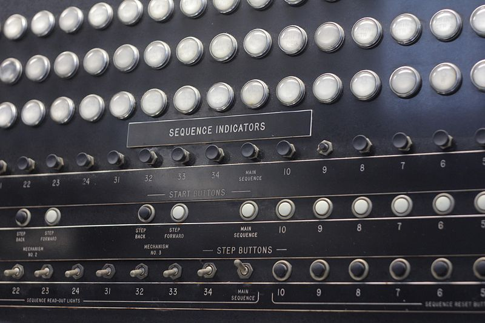

`Индикаторы и переключатели «Марк I»`

На вход перцептрона подаются веса **w** и исходные данные **x**, а их произведение корректируется смещением **b**.

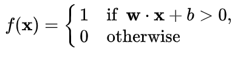

В 1960 году Бернард Уидроу и Тед Хофф разработали однослойную нейросеть [ADALINE](https://en.wikipedia.org/wiki/ADALINE) и её улучшенную версию — трёхслойную MADALINE. Это были первые глубокие (для того времени) архитектуры, но в них ещё не использовался метод обратного распространения ошибки. 

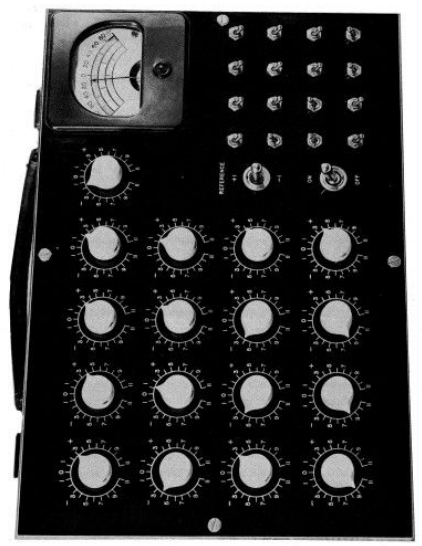

`ADALINE`

Алгоритм backpropagation появился в 1986 году в работе Дэвида Румельхарта, которая называлась [«Многослойный перцептрон»](https://ru.wikipedia.org/wiki/%D0%9C%D0%BD%D0%BE%D0%B3%D0%BE%D1%81%D0%BB%D0%BE%D0%B9%D0%BD%D1%8B%D0%B9_%D0%BF%D0%B5%D1%80%D1%86%D0%B5%D0%BF%D1%82%D1%80%D0%BE%D0%BD_%D0%A0%D1%83%D0%BC%D0%B5%D0%BB%D1%8C%D1%85%D0%B0%D1%80%D1%82%D0%B0). В нём используются уже знакомые нам уравнения, правило дифференцирования и выходные значения в диапазоне от 0 до 1.

Затем в развитии машинного обучения начался период застоя, поскольку компьютеры того времени были не пригодны для создания масштабных моделей. В 2006 году Джеффри Хинтон и Руслан Салахутдинов опубликовали [статью](https://www.ncbi.nlm.nih.gov/pubmed/16873662), в которой показали, как можно эффективно обучать глубокие нейросети. Но даже тогда они пока не приобрели современный вид.

Первых по-настоящему впечатляющих результатов исследователи искусственного интеллекта достигли в 2012 году, когда почти одновременно появились успешные решения задач [распознавания речи](https://static.googleusercontent.com/media/research.google.com/ru//pubs/archive/38131.pdf) и [классификации изображений](https://papers.nips.cc/paper/4824-imagenet-classification-with-deep-convolutional-neural-networks.pdf). Тогда же была представлена первая свёрточная нейросеть [AlexNet](https://en.wikipedia.org/wiki/AlexNet), которая достигла высокой на тот момент точности классификации датасета ImageNet. С тех пор подобные архитектуры довольно широко применяются в разных областях.

## Нейросети повсюду

Свёрточные сети хорошо справляются с огромными наборами данных и эффективно [обучаются](https://www.reg.ru/cloud-services/cloud_gpu/machine_learning) на графических процессорах за счёт параллельных вычислений. Эти особенности стали ключом к тому, что в настоящее время искусственный интеллект используется практически везде. Он решает задачи классификации и поиска изображений, обнаружения объектов, сегментации, а также применяется в более специализированных областях науки и техники.

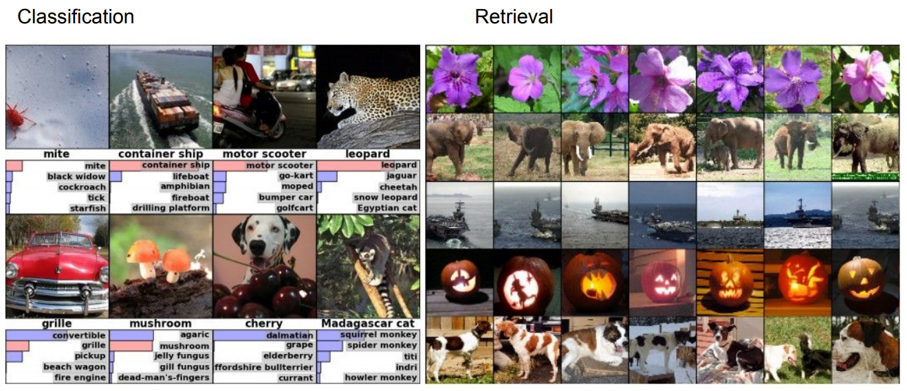

`Примеры задач классификации и поиска изображений`

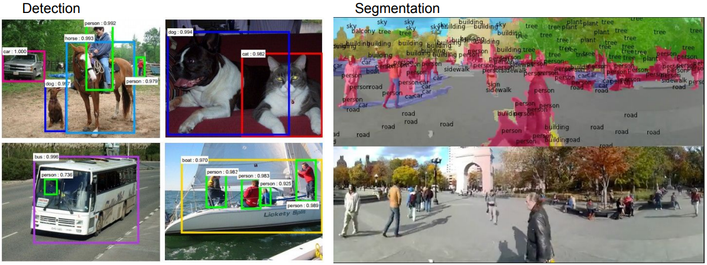

`Примеры детектирования объектов и сегментации`

Нейросети активно развиваются и уже используются в автономных автомобилях, в задачах распознавания лиц, классификации видео, определения позы или жестов человека. Кстати, именно свёрточные архитектуры научились обыгрывать людей в [шахматы](https://ru.wikipedia.org/wiki/AlphaZero) и [го](https://nplus1.ru/material/2016/03/10/gogogo). Среди других специфичных применений — анализ медицинских изображений, сегментация географических карт, составление текстового описания по фото (Image captioning) и перенос стиля художников на фотографии.

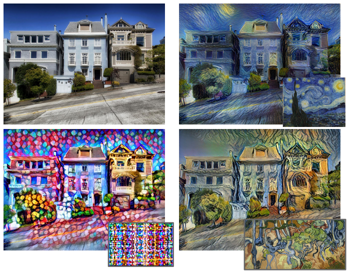

`Примеры переноса стиля`

Эта лишь малая часть примеров использования свёрточных сетей. Давайте разберёмся, как они работают и что делает их такими разносторонними.
Как устроены свёрточные сети

На прошлой лекции мы обсудили идею создания полносвязных линейных слоёв. Предположим, что у нас есть исходное 3D-изображение 32x32x3. Растянем его в один длинный вектор 3072x1 и перемножим с матрицей весов размером, для примера, 10x3072. В итоге нам нужно получить активацию (вывод с оценками классов) — для этого берём каждую из 10 строк матрицы и выполняем скалярное произведение с исходным вектором.

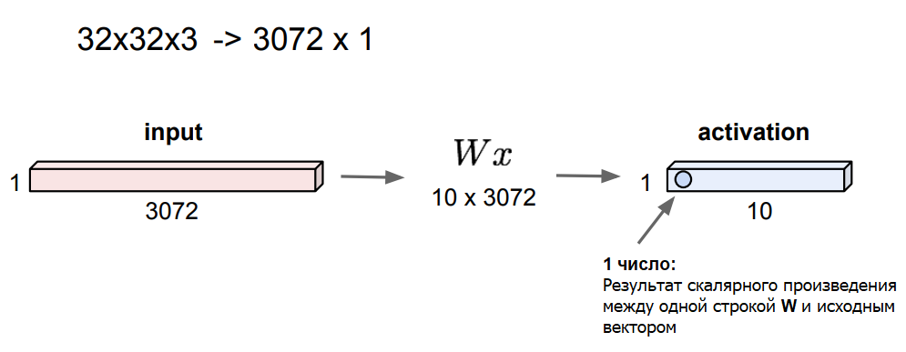

В результате получим число, которое можно сравнить со значением нейрона. В нашем случае получится 10 значений. По этому принципу работают полносвязные слои.

Основное отличие свёрточных слоёв в том, что они сохраняют пространственную структуру изображения. Теперь мы будем использовать веса в виде небольших фильтров — пространственных матриц, которые проходят по всему изображению и выполняют скалярное произведение на каждом его участке. При этом размерность фильтра (не путать с размером) всегда соответствует размерности исходного снимка.

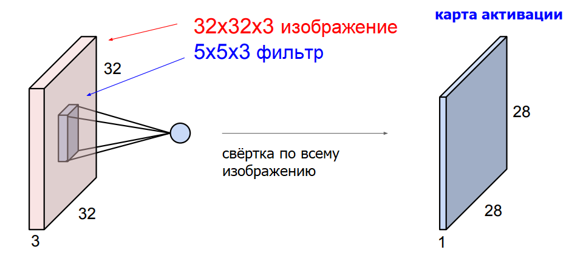

В результате прохода по изображению мы получаем карту активации, также известную как карта признаков. Этот процесс называется пространственной свёрткой — более подробно о нём можно почитать в статье [Свёртка в Deep Learning простыми словами](https://www.reg.ru/blog/svyortka-v-deep-learning-prostymi-slovami/). Из неё вы также можете узнать, почему размер карты активации получается меньше, чем у исходной фотографии.

К изображению можно применять множество фильтров и получать на выходе разные карты активации. Так мы сформируем один свёрточный слой. Чтобы создать целую нейросеть, слои чередуются друг за другом, а между ними добавляются функции активации (например, [ReLU](https://en.wikipedia.org/wiki/Rectifier_(neural_networks)) и специальные pooling-слои, уменьшающие размер карт признаков.

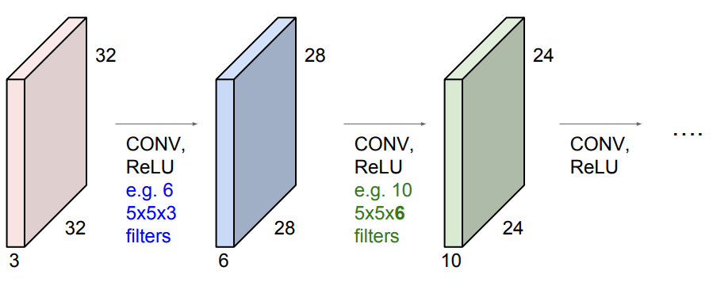

Рассмотрим подробнее, что же представляют собой свёрточные фильтры. В самых первых слоях они обычно соотносятся с низкоуровневыми признаками изображения, например, с краями и границами. В середине присутствуют более сложные особенности, такие как углы и окружности. И в финальных слоях фильтры уже больше напоминают некие специфичные признаки, которые можно интерпретировать более широко.

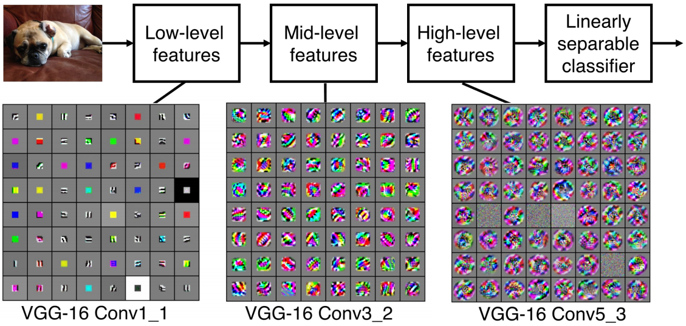

`Примеры фильтров для свёрточных слоёв нейросети VGG-16`

На рисунке ниже показаны примеры фильтров 5x5 и карты активации, которые получаются в результате их применения к исходному изображению (в левом верхнем углу). Первый фильтр (обведён в красную рамку) похож на небольшой участок границы, наклонённой вправо. Если мы применим его к фотографии, то наиболее высокие значения (белого цвета) получатся в тех местах, где есть края примерно с такой же ориентацией. В этом можно убедиться, посмотрев на первую карту активации

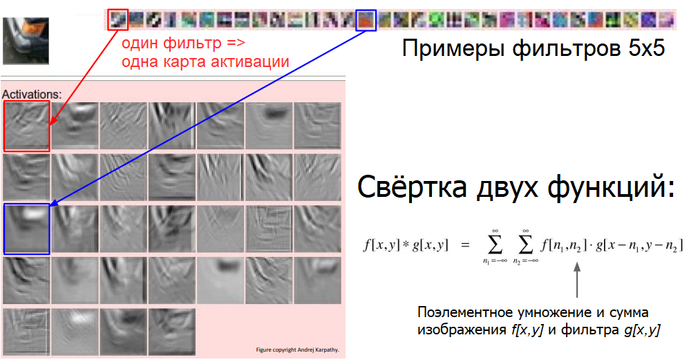

Таким образом, один слой нейросети находит наиболее похожие на заданные фильтры участки изображения. Этот процесс очень похож на обычную свёртку двух функций. Она показывает, насколько объекты коррелируют друг с другом.

Сложив всё вместе, мы получим примерно следующую картину: взяв исходную фотографию, мы проводим её через чередующиеся свёрточные слои, функции активации и pooling-слои. В самом конце мы используем обычный полносвязный слой, соединённый со всеми выводами, который показывает нам итоговые оценки для каждого класса. 

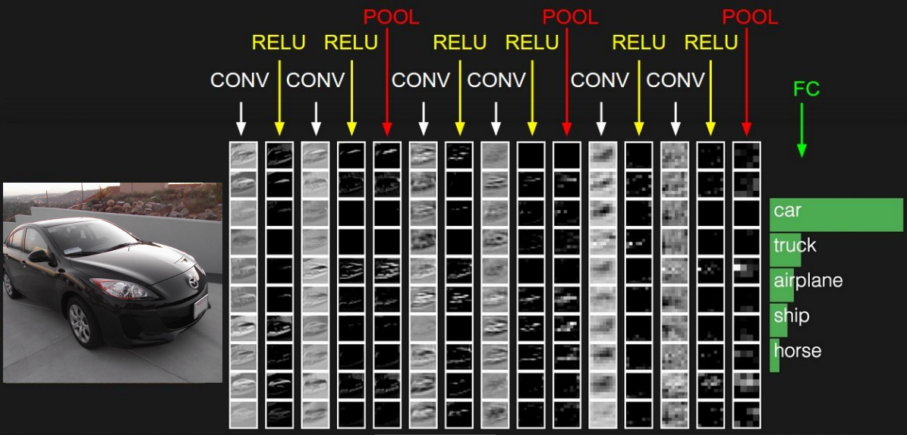

`Схема работы свёрточной нейросети`

По такому принципу работают современные свёрточные нейросети.
Подводя итоги

Итак, посмотрим на полный набор функций свёрточного слоя:

 1. Принимает исходное изображение определённой размерности **W1 x H1 x D1**.
 
2. Использует четыре гиперпараметра для фильтров:

    * число фильтров **K**;
    
    * их размер **F**;
    
    * шаг **S**;
    
    * число дополнительных нулей **P** (используются для заполнения «потерянных» участков изображения после применения свёртки).
    
3. Выводит карту активации размером W2x H2 x D2, где:
 
    * **W2= (W1− F + 2P) / S + 1**
    
    * **H2= (H1− F + 2P) / S + 1**
    
    * **D2 = K**
    
4. Использует **F * F * D1** весов на каждый фильтр, в общей сложности **(F * F * D1) * K** весов и **K** смещений. 

Если мы посмотрим на код фреймворка Caffe, который мы упоминали на прошлой лекции, то увидим примерно те же параметры:

Вы можете наглядно проследить за процессом обучения настоящей свёрточной нейросети с помощью этой [веб-демонстрации](https://cs.stanford.edu/people/karpathy/convnetjs/demo/cifar10.html). Посмотрите, как выглядят фильтры слоёв и какие для них получаются карты активации. Если подождать некоторое время, то на графике обучения можно заметить уменьшение потерь. В самом низу страницы — прогнозы нейросети на тестовой выборке.

Чтобы закрепить знания, полученные на всех предыдущих лекциях, мы подготовили для вас задание. Попробуйте реализовать классификатор ближайшего соседа, метод опорных векторов, softmax-классификатор и простую двухслойную нейросеть. Не обязательно выполнять всё вышеперечисленное: можете взяться только за то, что вам интересно или не до конца понятно. По [ссылке](https://drive.google.com/file/d/16cJpdZroHU-BiuZdIk6jLweILP-CRIUm/view) вы найдёте все необходимые файлы и инструкции.

Для выполнения задания вам понадобится Python > 3.6 и среда Jupyter Notebook или Jupyter Lab.

