# Лекция 7. Обучение нейросетей, часть 2

Хотя мы уже рассмотрели наиболее важные аспекты обучения нейросетей, стоит взять на заметку ещё несколько интересных и полезных стратегий. Как упоминалось ранее, для получения хороших и точных результатов важно применять оптимизацию (добиваться минимального значения функции потерь) и регуляризацию (упрощать модель, чтобы избежать переобучения). Выясним, как именно эти процессы выглядят на практике.

## Оптимизация: подводные камни

Мы говорили, что функция потерь показывает, насколько хорошо или плохо выбранные веса справляются с поставленной задачей (например, с классификацией изображений). В двумерном пространстве значения функции можно представить в виде цветного «ландшафта», где наиболее тёплый регион (красный) — наименьшая величина потерь, к которой мы стремимся; а холодный (синий) — наибольшая. Рассмотрим простой пример оптимизации для двух значений функции потерь: **W_1** и **W_2**.

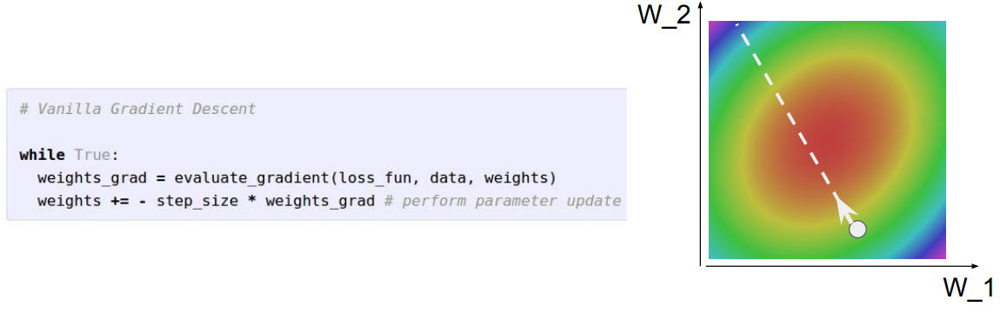

Самый тривиальный алгоритм оптимизации — стохастический градиентный спуск, реализуемый всего в три строки кода. Он обновляет параметры, вычисляя отрицательное направление градиента, которое соответствует наибольшему уменьшению функции потерь. Выполняя эту операцию много раз, мы, возможно, достигнем красного региона, получим минимум ошибок и будем счастливы.

Но, к сожалению, на практике метод сопровождается множеством проблем. Представим, что мы поменяли одно из значений, например, **W_2**. При этом наши потери стали уменьшаться очень быстро. Тогда мы меняем значение **W_1**, но теперь прогресс идёт гораздо медленнее. Выводя это на график, мы увидим, что функция потерь более чувствительна к изменениям в вертикальном направлении, чем в горизонтальном. Стохастический градиентный спуск будет выглядеть зигзагообразно — и это не очень хорошо, поскольку прогресс оптимизации слишком медленный.

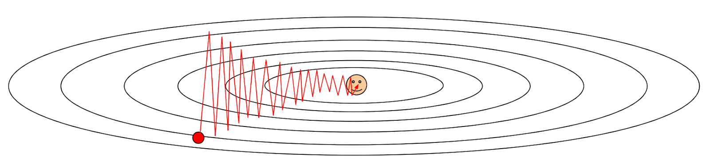

Ещё одна распространённая проблема — локальные минимумы и [седловые точки](https://ru.wikipedia.org/wiki/%D0%A1%D0%B5%D0%B4%D0%BB%D0%BE%D0%B2%D0%B0%D1%8F_%D1%82%D0%BE%D1%87%D0%BA%D0%B0). Если функция имеет форму сложной кривой, как показано на рисунке ниже, градиентный спуск может «застрять» в одном из её углублений — локальном экстремуме.

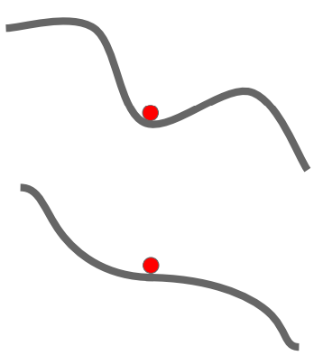

Проблема с седловыми точками возникает, когда в одном направлении функция возрастает, а в другом — убывает. Самый простой пример двумерной седловой точки — ноль на графике **y = x^3**. В трёхмерном пространстве образующаяся поверхность напоминает седло, из-за чего и появилось такое название. При попадании в седловую точку градиентный спуск застопорится на локальном минимуме. И независимо от числа дальнейших итераций функция потерь практически не уменьшится.

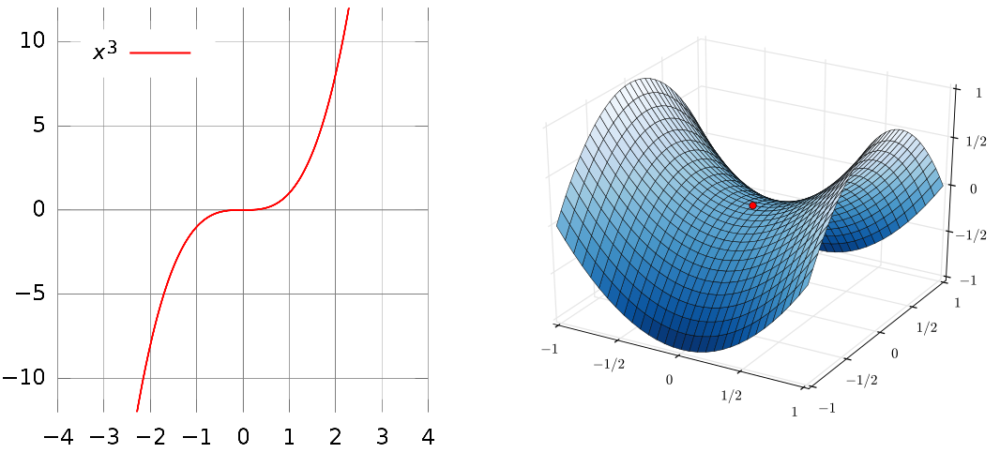

`Примеры графиков с седловыми точками`

Трудности возникают также из-за зашумлённых данных, которые могут в большом количестве оказаться в пакете образцов, обычно использующемся для стохастического градиентного спуска.

## Улучшенная оптимизация

Глядя на вышеупомянутые затруднения, возникает логичный вопрос: какой же алгоритм оптимизации поможет их избежать? 

#### SGD + Momentum

К счастью, есть очень простая стратегия, решающая большинство проблем. Её идея в том, чтобы сохранить скорость градиентного спуска, добавив для этого некоторый импульс (momentum). Теперь вместо простого итеративного вычисления градиента мы прибавляем к нему подсчёт скорости и дописываем две строки в наш код.

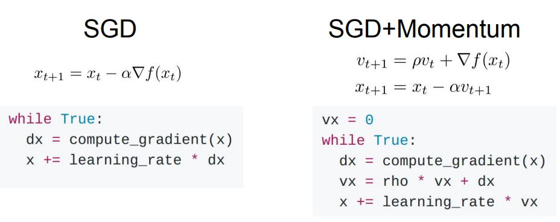

Таким образом, мы будем двигаться в направлении изменения скорости, а не в направлении градиента. Гиперпараметр rho соответствует трению, как при движении по твёрдой поверхности.

Что же теперь произойдёт в локальном минимуме или седловой точке? Здесь можно провести аналогию с шариком, который катится с горки. Как только он дойдёт до точки, где градиент равен нулю, он по-прежнему сохранит некоторую скорость и будет двигаться дальше.

#### Nesterov Accelerated Gradient

Одна из разновидностей этого алгоритма — **ускоренный градиент Нестерова** (Nesterov Accelerated Gradient). Посмотрим на рисунок ниже, где градиентный спуск стартует из красной точки. Мы знаем, что импульс собирается приблизить нас к вершине зеленой стрелки. Вместо того, чтобы оценивать градиент в текущей позиции (красная точка), мы оцениваем градиент сразу в новой позиции. Так мы найдём точку в окрестности, где окажемся в следующий момент.

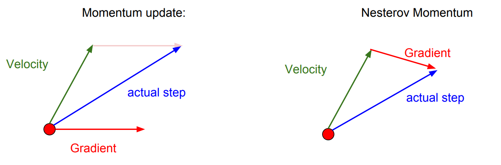

Ниже можно увидеть, как это выглядит в виде формул и кода. На графике показано сравнение обычного градиентного спуска (чёрная линия), градиентного спуска с импульсом (синяя линяя) и ускоренного градиента Нестерова (зелёная линия).

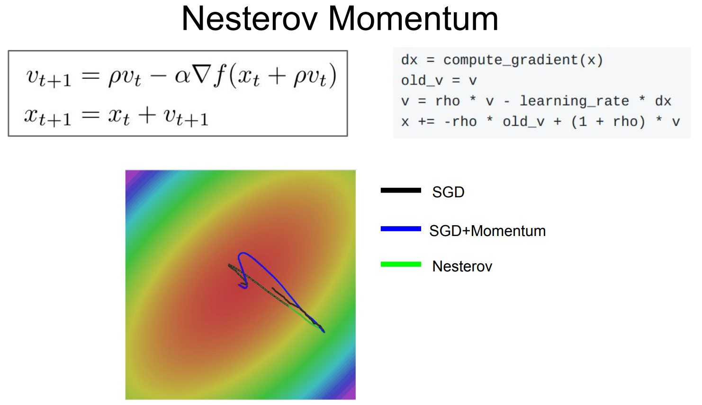

#### AdaGrad

Другой популярный метод оптимизации называется AdaGrad. На каждом шаге мы вычисляем промежуточную сумму всех квадратов градиентов, которые считаются во время обучения. Полученное значение используется для нормализации — мы просто делим параметры на корень из суммы квадратов. 

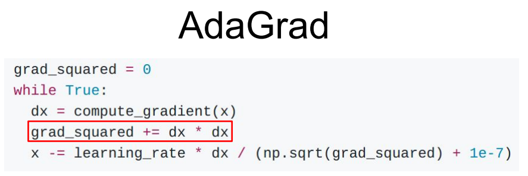

Вспомним ситуацию, когда наша функция слишком быстро менялась в одном направлении и медленно в другом. Это значит, что у одной из координат было большое значение градиента, а у другой — маленькое. Если мы возьмём корень из суммы квадратов небольшого градиента, то будем делить параметры на маленькое число и тем самым ускорим движение в медленном направлении. С большими значениями будет ровно наоборот, что в теории должно сгладить зигзагообразную кривую. Но здесь же кроется загвоздка — если значения градиента постоянно растут, то мы начнём делить параметры на всё большие числа и шаги будут становиться всё медленнее.

#### RMSProp

Усовершенствованный алгоритм, называемый RMSProp, отчасти решает эту проблему. Вместо простого суммирования он использует скользящее среднее квадратов градиентов, что фактически уменьшает значение grad_squared и не даёт оптимизации замедляться. На рисунке ниже показана реализация RMSProp.

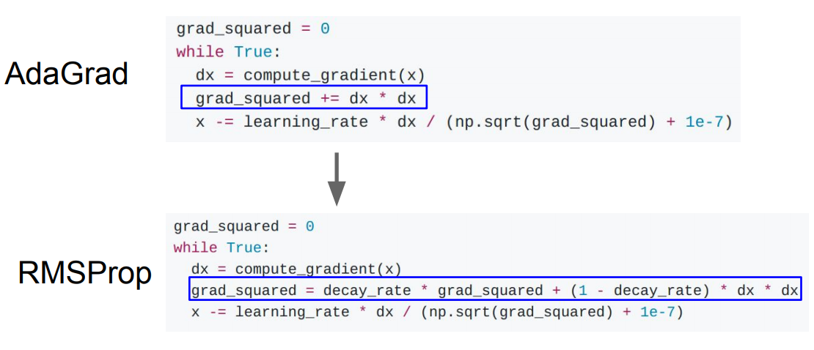

#### Adam

Adam объединяет в себе преимущества RMSProp, AdaGrad и SGD+Momentum. Сначала мы выполняем оценку первого импульса и взвешенной суммы градиентов, а затем оцениваем второй импульс и квадрат градиентов. Первый импульс играет роль скорости, а второй служит для оптимизации параметров.

Изначально оба параметра равны нулю, поэтому к ним добавляется корректирующее смещение, чтобы избежать слишком большого шага в самом начале.

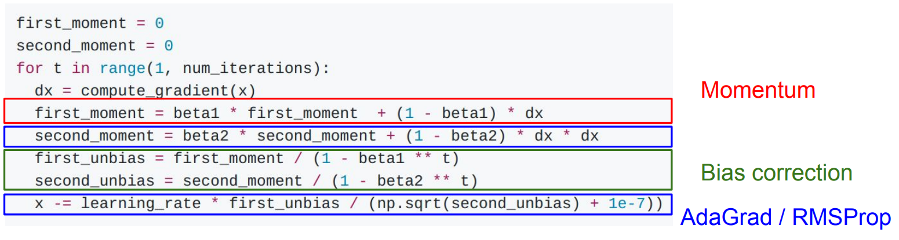

На анимациях ниже продемонстрировано, как ведут себя различные алгоритмы оптимизации. Можно увидеть, что обычный SGD работает гораздо медленнее всех упомянутых методов. Справа показано поведение в седловой точке, быстрее всего которую преодолевает AdaDelta — ещё одна вариация AdaGrad, очень похожая на Adam за исключением того, что в ней отсутствует импульс.

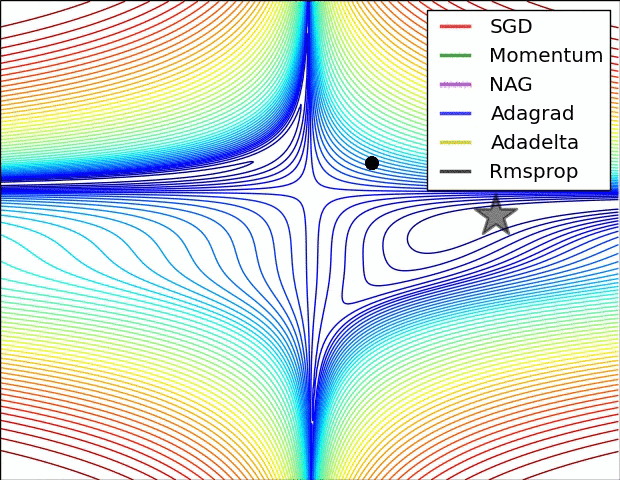 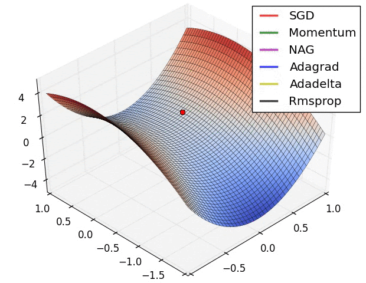

## Оптимизация второго порядка

Все алгоритмы, описанные выше, относятся к оптимизации первого порядка, поскольку для градиента нам необходимо считать только первые производные ([якобиан](https://ru.wikipedia.org/wiki/%D0%AF%D0%BA%D0%BE%D0%B1%D0%B8%D0%B0%D0%BD)). Но существует также оптимизация второго порядка, учитывающая как первую, так и вторую производные. В ней используется приближение Тейлора, которое локально аппроксимирует функцию к квадратичной и позволяет быстрее достичь минимума.

Обобщая этот подход в многомерное пространство, мы получим так называемый [шаг Ньютона](https://en.wikipedia.org/wiki/Newton%27s_method_in_optimization). В нём сначала вычисляется [гессиан](https://ru.wikipedia.org/wiki/%D0%93%D0%B5%D1%81%D1%81%D0%B8%D0%B0%D0%BD_%D1%84%D1%83%D0%BD%D0%BA%D1%86%D0%B8%D0%B8) (вторые производные), а затем берётся обратная матрица для более быстрого перехода к минимуму квадратичной аппроксимации нашей функции.

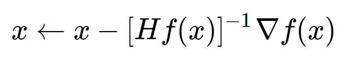

`Шаг Ньютона. Hf(x) — гессиан, ∇f(x) — якобиан.`

Однако приведенное выше уравнение нецелесообразно для большинства приложений глубокого обучения, поскольку вычисление (и инвертирование) гессиана — очень дорогостоящий процесс. Поэтому существующие методы пытаются аппроксимировать обратный гессиан. Среди них наиболее популярным является [L-BFGS](https://en.wikipedia.org/wiki/Limited-memory_BFGS), который использует для этого информацию о нескольких последних значениях градиента.

На практике оптимизация второго порядка редко применяется к масштабным нейронным сетям. Вместо неё используются стандартные алгоритмы первого порядка, основанные на градиентном спуске, потому что они проще вычисляются и легче масштабируются.

## Ансамблевые методы

Иногда кажется, будто мы уже нашли подходящий алгоритм оптимизации и достигли хорошей точности, но этого всё ещё недостаточно. Что же можно сделать, чтобы модель работала лучше?

На помощь придёт способ «одна голова — хорошо, две — лучше, а ещё лучше — десять!», который также известен как ансамблевый метод. Вместо того, чтобы использовать одну нейросеть, можно независимо обучить несколько архитектур, а во время тестирования взять их усреднённый результат. Это помогает уменьшить переобучение и немного улучшить эффективность модели (обычно на пару процентов). Также вместо разных алгоритмов можно взять несколько версий одной нейросети.

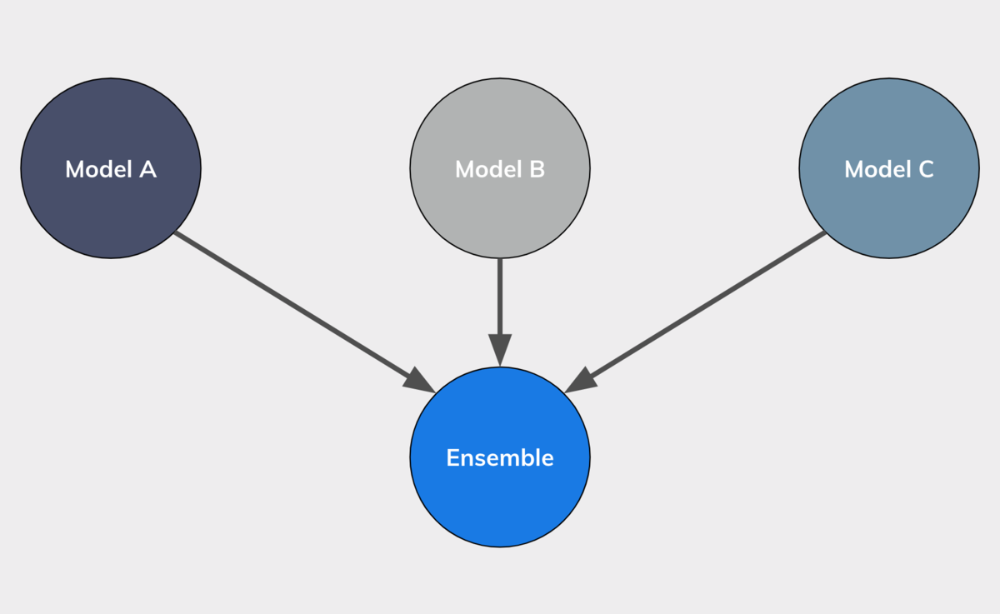

## Выбор скорости обучения

Ни один метод не достигнет хороших результатов без правильной настройки гиперпараметров, самый важный из которых — скорость обучения (learning rate). В процессе оптимизации глубоких сетей скорость обычно уменьшают с течением времени. Это связано с тем, что при высоких значениях наша система будет содержать слишком много кинетической энергии. Вектор параметров не сможет приблизиться к минимуму функции потерь и начнёт хаотично перемещаться вокруг него.

Заранее предугадать, когда следует уменьшить скорость обучения, может быть непросто: если она будет затухать медленно, вы потратите слишком много вычислительных ресурсов и долго не будете наблюдать улучшений. Но чересчур агрессивное затухание приведёт к преждевременной остановке обучения. 

Существует три распространенных способа снижения learning rate:

**Пошаговое затухание:** снижение скорости на некоторую величину каждые несколько эпох. Типичные варианты: уменьшение в два раза каждые 5 эпох или в 0.1 раз каждые 20 эпох. Конкретные цифры сильно зависят от задачи и модели.

**Экспоненциальное затухание и затухание 1/t**: имеют вид, показанный на рисунке ниже. Здесь **α0** и **k** — гиперпараметры, а **t** — номер итерации.

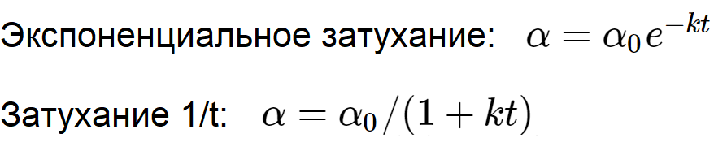

## Регуляризация Dropout

Регуляризация используется для упрощения модели, чтобы избежать переобучения и заставить её корректно работать на новых данных. Мы уже [говорили](lesson3.md) о методах L1, L2 и Elastic net. Но чаще всего в машинном обучении применяется эффективный и простой алгоритм [Dropout](http://www.cs.toronto.edu/~rsalakhu/papers/srivastava14a.pdf).

Каждый раз, выполняя прямой проход по слою, мы устанавливаем некоторые значения активаций нулевыми (нейроны выбираются случайно). В результате мы получим несколько «подсетей» и будем поочерёдно оценивать их эффективность, что делает dropout похожим на ансамбль методов.

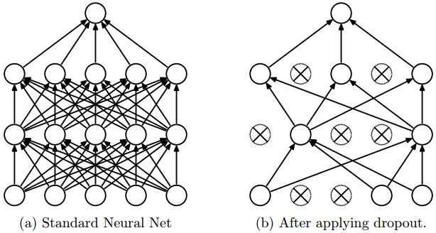

Самая простая реализация для трёхслойной нейросети выглядит следующим образом:
	
    """ Vanilla Dropout: не рекомендуется использовать на практике """
     
    p = 0.5 # вероятность оставить нейрон активным. Чем выше, тем меньше dropout
     
    def train_step(X):
      """ X - данные """
      
      # прямой проход по трёхслойной нейросети
      H1 = np.maximum(0, np.dot(W1, X) + b1)
      U1 = np.random.rand(*H1.shape) < p # первый dropout
      H1 *= U1 # drop!
      H2 = np.maximum(0, np.dot(W2, H1) + b2)
      U2 = np.random.rand(*H2.shape) < p # второй dropout
      H2 *= U2 # drop!
      out = np.dot(W3, H2) + b3
      
      # обратный проход: вычисление градиентов... (не показано)
      # обновление параметров... (не показано)
      
    def predict(X):
      # ансамблевый прямой проход
      H1 = np.maximum(0, np.dot(W1, X) + b1) * p # масштабируем активации!
      H2 = np.maximum(0, np.dot(W2, H1) + b2) * p # масштабируем активации!
      out = np.dot(W3, H2) + b3
      
Нежелательное свойство представленной выше схемы состоит в том, что мы должны масштабировать активации во время прогнозирования. Поскольку производительность тестирования критически важна, лучше всего использовать **инвертированный dropout**, который выполняет масштабирование во время обучения. Кроме того, если мы захотим убрать dropout из кода, функция прогнозирования останется без изменений.
	
    """ 
    Inverted Dropout: Рекомендуемая реализация
    """
     
    p = 0.5 # вероятность оставить нейрон активным. Чем выше, тем меньше dropout
     
    def train_step(X):
      # прямой проход по трёхслойной нейросети
      H1 = np.maximum(0, np.dot(W1, X) + b1)
      U1 = (np.random.rand(*H1.shape) < p) / p # первый dropout. Заметьте /p!
      H1 *= U1 # drop!
      H2 = np.maximum(0, np.dot(W2, H1) + b2)
      U2 = (np.random.rand(*H2.shape) < p) / p # второй dropout. Заметьте /p!
      H2 *= U2 # drop!
      out = np.dot(W3, H2) + b3
      
      # обратный проход: вычисление градиентов... (не показано)
      # обновление параметров... (не показано)
      
    def predict(X):
      # ансамблевый прямой проход
      H1 = np.maximum(0, np.dot(W1, X) + b1) # масштабирование не нужно
      H2 = np.maximum(0, np.dot(W2, H1) + b2)
      out = np.dot(W3, H2) + b3
      
Dropout очень полезен тем, что с его помощью можно менять силу регуляризации, просто варьируя значение параметра **p**.

## Дополнение данных

На этом регуляризация не заканчивается! Вы наверняка знаете о том, что нейросети должны находить на фотографии кошку, даже если снимок будет перевёрнут или обрезан. Для этого можно просто взять исходные изображения, выполнить над ними различные преобразования (масштабирование, отражение, поворот, обрезка, коррекция цветов) и дополнить уже существующий датасет. Эта стратегия также может оказаться очень полезной в тех случаях, когда исходных данных для обучения слишком мало.

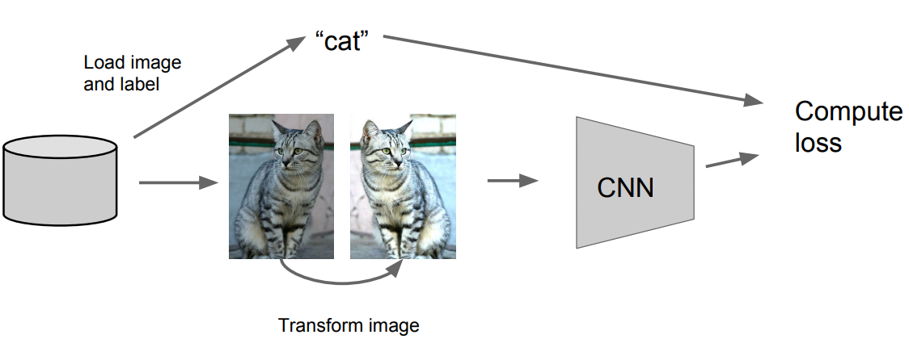

На практике при дополнения датасета также используется смещение пикселей, добавление [дисторсии](https://ru.wikipedia.org/wiki/%D0%94%D0%B8%D1%81%D1%82%D0%BE%D1%80%D1%81%D0%B8%D1%8F), [метод главных компонент](https://ru.wikipedia.org/wiki/%D0%9C%D0%B5%D1%82%D0%BE%D0%B4_%D0%B3%D0%BB%D0%B0%D0%B2%D0%BD%D1%8B%D1%85_%D0%BA%D0%BE%D0%BC%D0%BF%D0%BE%D0%BD%D0%B5%D0%BD%D1%82), увеличение/уменьшение яркости, контрастности, резкости и другие способы. Здесь можно дать волю своей фантазии.

## Передача обучения

При недостаточном количестве исходных образцов также стоит попробовать метод передачи обучения или Transfer Learning. Его суть заключается в том, что сначала мы обучаем нейросеть на большом наборе данных (например, ImageNet), а затем подстраиваем её под свой датасет. Для этого необходимо заново инициализировать матрицу весов последнего слоя и переобучить его, чтобы сеть адаптировалась под наши потребности.

Но это работает, только если данных действительно совсем немного. В других случаях, возможно, потребуется переобучить несколько слоёв или всю нейросеть.

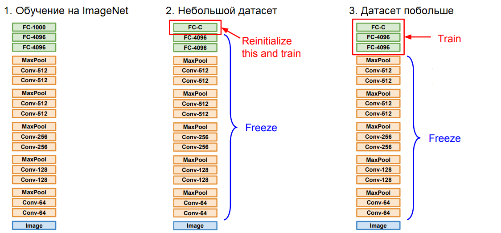

Мы заново обучаем только последние слои, оставляя предыдущие без изменений. Это связано с тем, что в первых слоях нейросети содержатся более общие признаки, в то время как последние отвечают за специфичные особенности.

## Практический пример

В качестве учебного примера к лекции предлагаем посмотреть, как один из методов минимизации работает на практике. Предположим, что у нас есть четырёхмерная функция. Требуется найти такую комбинацию входных параметров, при которых её значение минимально. В подобных задачах минимум часто нужно искать не в бесконечном пространстве, а в ограниченной области. Например, масса физически не может быть отрицательной, поэтому её значения надо искать только в положительном диапазоне.

Чтобы провести эксперимент, зададим целевую функцию и ограничения на область поиска.

##### Задача.

Решите проблему оптимизации, описанную ниже, с помощью любой Python-библиотеки на ваш выбор. Используйте два способа:

1\) аналитический якобиан и гессиан;

2\) конечно-разностную реализацию гессиана и якобиана.

Сравните результаты методов 1) и 2). Что вы можете сказать о них?

*   **min** x1x4(x1 + x2 + x3) + x3 — **Задача**

*   x1x2x3x4 ⩾ 25 — **Ограничивающее неравенство**

*   x1^2 + x2^2 + x3^2 + x4^2 = 40 — **Ограничивающее равенство**

*   1 ⩽ x1x2x3x4 ⩽ 5 — **Границы**

*   x0 = (1, 5, 5, 1)  — **Инициализация**

В пакете **SciPy** реализован отличный метод минимизации **trust-constr**, который умеет одновременно использовать якобиан, гессиан и ограничения области поиска. В машинном обучении аналитический вид функции неизвестен, следовательно, неизвестен и вид её производных. Поэтому вторую конфигурацию метода мы зададим «с завязанными глазами», выполняя только численное дифференцирование. Запустив прилагаемый [код примера](https://drive.google.com/file/d/1PJbXOmC-6yrRa4lCO9eQfjnwbpN-MDiZ/view), вы получите схожие результаты в обоих случаях.

